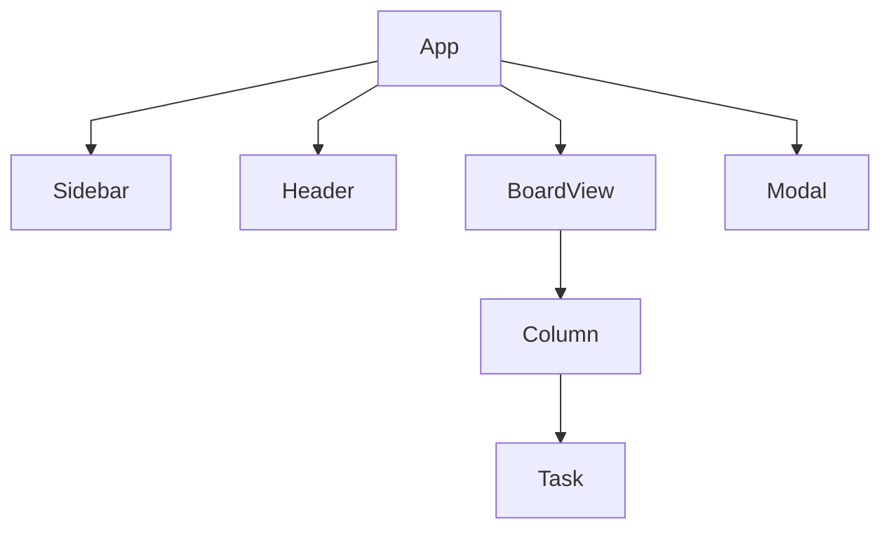
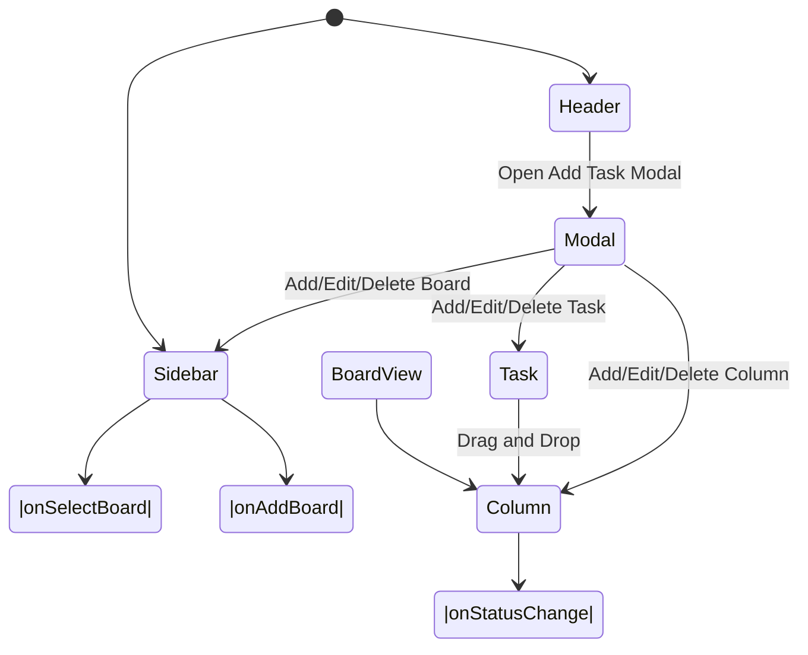
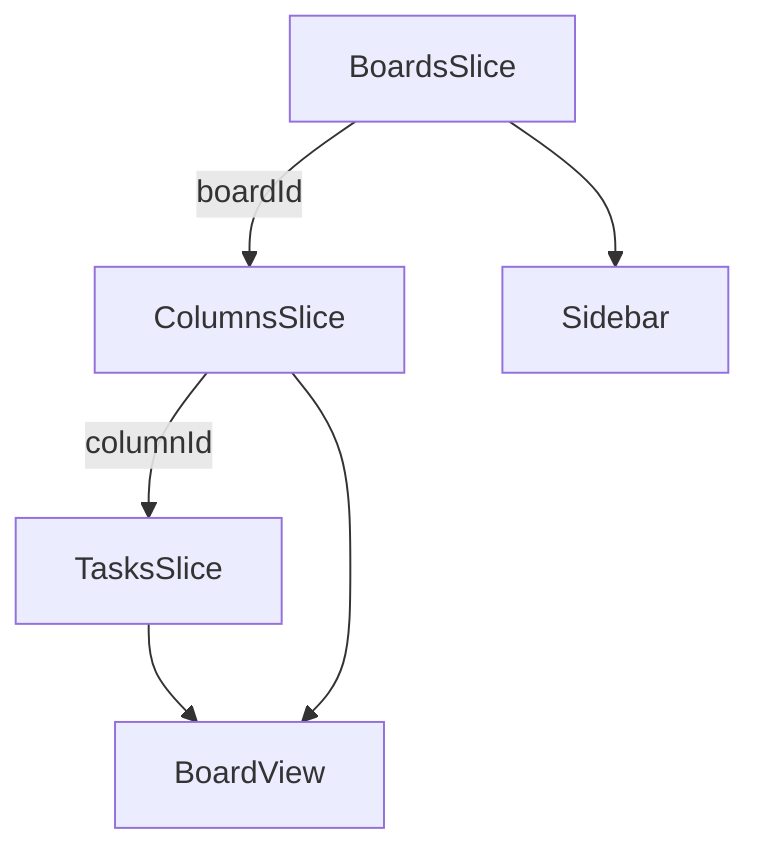
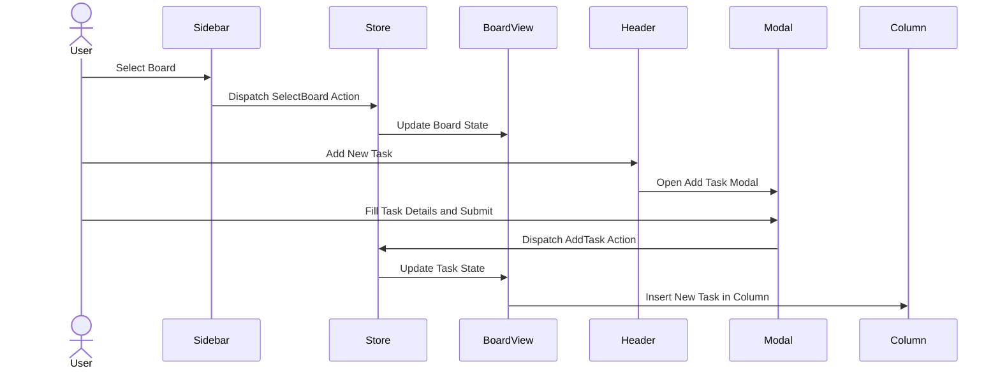
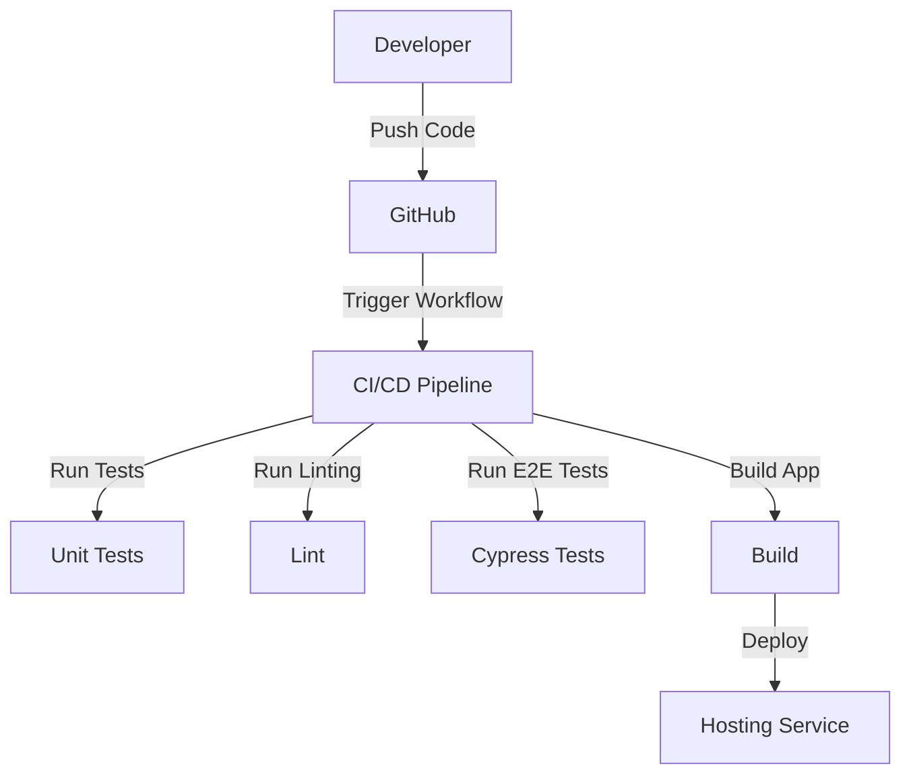
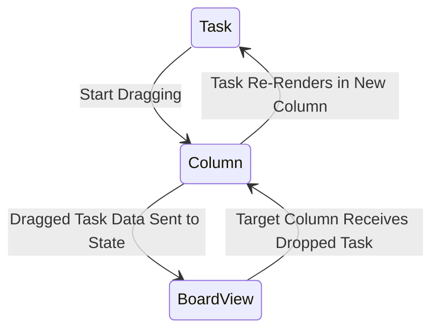
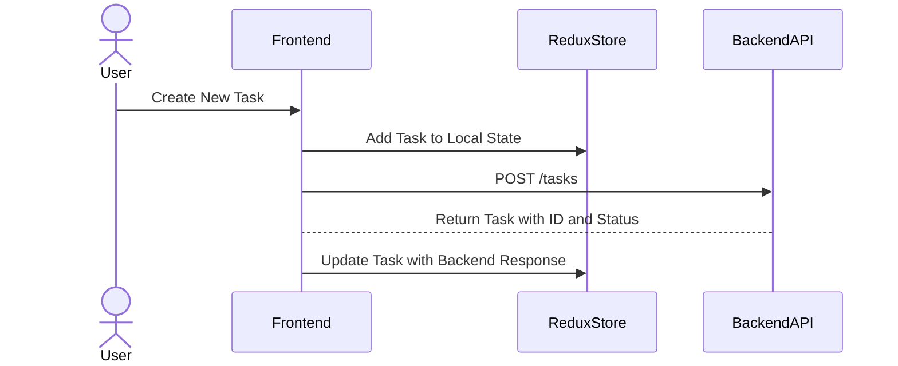

# Frontend Architecture and Workflow Diagrams

This file contains key diagrams that illustrate the architecture, workflows, and state management of the Kanban Frontend application.

## Component Hierarchy

This diagram illustrates the top-level structure of the Kanban frontend application and how components interact with one another.

- **App**: The root component that initializes and manages the entire application.
  - **Sidebar**: Displays the list of boards and allows switching between them or adding new boards.
  - **Header**: Displays the current board's title and provides actions like opening the "Add New Task" modal.
  - **BoardView**: Contains all the columns and tasks of the selected board.
    - **Column**: Represents a single column; contains tasks with drag-and-drop functionality.
    - **Task**: Represents an individual task; clicking it opens the task details/edit modal.
  - **Modal**: A reusable modal component for editing boards, columns, or tasks.

## State Flow

This diagram illustrates the flow of data and state interactions within the application. The state is globally managed using Redux Toolkit slices for boards, columns, and tasks

- The primary app state transitions occur via user interactions (e.g., selecting a board, dragging tasks).
- Redux slices (e.g., boardsSlice, tasksSlice) handle state changes in response to dispatched actions.
- The Modal is used for CRUD operations (Create, Read, Update, Delete) on boards, columns, and tasks.

## Data Flow Between Slices

- BoardsSlice:
  - Stores data about all boards.
  - Provides data to the Sidebar and facilitates board switching in BoardView.
- ColumnsSlice:
  - Stores data of columns.
  - Supplies column-specific data to the BoardView.
- TasksSlice:
  - Stores information about individual tasks.
  - Supplies task details to Task components and supports drag-and-drop workflows.

This state hierarchy ensures a normalized database-like structure, avoiding duplication of data between slices.

## End-to-End Workflow

This diagram illustrates the typical workflow when a user interacts with the app, from executing actions to triggering state updates and UI changes.

1. Board Selection:
   - The user clicks a board in the Sidebar.
   - A Redux action is dispatched, updating the currently active board in the state.
   - The BoardView re-renders, displaying the selected board’s columns and tasks.
2. Adding a Task:
   - The user selects "Add New Task" in the Header, which opens the Modal.
   - On submitting the task details, a Redux action is dispatched to add the task.
   - The BoardView updates to reflect the new task in the associated column.

## CI/CD Workflow

This diagram demonstrates the CI/CD pipeline steps for the project, automated using GitHub Actions.

## Planned Drag-and-Drop Implementation

This diagram illustrates how drag-and-drop functionality for tasks within and across columns works.

1. Start Dragging:
   - A task component is dragged using a library like react-dnd or @dnd-kit.
   - Data about the dragged task is captured and sent to the BoardView.
2. Drop Task:
   - The task is dropped into a column.
   - A Redux action updates the task’s `status` and `columnId` in the application state.
3. Update Column:
   The affected columns re-render to reflect the updated task placement.

## API Interaction Workflow (Future)

Though the backend isn't implemented yet, here’s the planned interaction between the frontend and backend.

